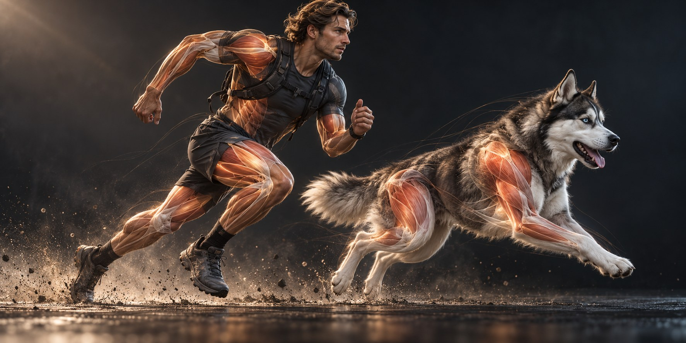

# DynamicBodySystem

*Concept artwork illustrating the intended visual direction; the plugin does not include these character assets.*

An Unreal Engine 5.5+ runtime plugin for data-driven character muscle and soft-tissue **morphs**. The same code can be used with humans, dogs, or other skeletal creatures by authoring a profile and compatible morph targets for each mesh.

## Current scope (0.2.0)

- A `UDynamicBodyProfile` data asset describes joint-driven muscle morphs and spring-driven soft-tissue regions.
- `UDynamicBodyComponent` reads the evaluated skeletal pose, estimates component acceleration, and writes morph weights to its skeletal mesh after the mesh tick.
- `UDynamicBodySubsystem` sets a world-wide quality level. The effective tier reduces at 10 m and 25 m, and turns off at 50 m from the first local player's pawn. The player pawn keeps its selected tier.
- Off, Low, Medium, High, Cinematic and Auto are available. Auto currently resolves to Medium; the host game's graphics preset can set the subsystem explicitly.
- Optional post-exertion vascular response fades in under sustained high exertion, lingers during rest, then fades out. A reserved Custom Primitive Data float drives a vein mask in skin materials at Medium+; subtle vein-bulge morphs may be enabled at High+.
- All computation runs on the game thread. No Chaos Flesh, body collision, Deformer Graph, editor profile tool, hardware benchmark, or global time-budget manager is implemented yet.

## Install

Copy this repository to `<YourProject>/Plugins/DynamicBodySystem`, enable the plugin, then build the C++ project with Unreal Engine 5.5 or later. The plugin does not include a sample skeletal mesh or sculpted morphs. An Unreal Engine installation is required to compile and test in editor.

## Authoring a profile

1. On the target skeletal mesh, sculpt each desired muscle and tissue pose as morph targets. Give each morph a **unique** name that this component alone controls.
2. Create a **Dynamic Body Profile** data asset. Add muscle entries using the joint and parent bone names from that mesh's skeleton. `RestAngleDegrees` is the joint's local Pitch/Yaw/Roll angle at rest; set a positive or negative `FullActivationDeltaDegrees` toward contraction. Use a muscle morph for the fully contracted shape.
3. For each tissue region, create positive and negative morph shapes along a component-local axis. Set `MaximumDisplacementCm` to the virtual spring displacement that should produce full morph weight. Start with `Mass=1`, `Stiffness=65`, `Damping=12`, and adjust in play. The neutral mesh should contain the intended rest shape.
4. Add **Dynamic Body Component** to the character, assign the profile and optionally its target skeletal mesh. By default it finds the first skeletal mesh component on the owner. Use distinct profiles for different rigs or mesh morph names.
5. From the game graphics menu, call `GetWorldSubsystem<UDynamicBodySubsystem>()->SetGlobalQuality(...)` and save that enum value in the host game's own user settings. Restore it on startup. A component's `QualityOverride` can override the global value.

`DetailTier` selects where an entry starts: 1=Low, 2=Medium, 3=High, 4=Cinematic. Each active entry writes a morph weight between 0 and 1. Entries filtered out by tier are reset to zero. Do not assign the same morph target to several entries or animate it from another system simultaneously. Meshes without authored morph targets have no visible deformation.

## Vascular response after exertion

This optional layer is a visual effect, not a blood-flow simulation. In the profile, enable **Vascular**, tune `ExertionThreshold`, `BuildSeconds`, `RecoverySeconds`, and `VisibilityThreshold`, then choose its outputs:

- **Material (Medium+)**: reserve one otherwise unused `PrimitiveDataIndex` on the skeletal mesh (the default `-1` disables this output). In the skin material, create a scalar parameter, enable **Use Custom Primitive Data**, and assign it exactly the same index. Multiply this 0–1 intensity by an authored vein-region mask before blending subtle color, normal, or roughness changes. Keep masked areas anatomically appropriate. A global Material Parameter Collection is unsuitable because each character can have a different intensity.
- **Geometry (High+)**: optionally sculpt restrained vein-bulge Morph Targets for specific muscle areas and add them as Vascular Regions. `MaximumWeight` limits each morph's contribution. A character without these authored assets can still use the material response.

The host game calls `DynamicBodyComponent->SetExertionIntensity(Value)` with a normalized value during running, combat, lifting, or similar effort, then calls it with `0` when the character rests. A Blueprint can call the same function. The input persists until changed: always send `0` when the activity ends. Exertion below the configured threshold will not build the effect. After high effort the response decays over time even while the character is resting or the effect is hidden by LOD. When the profile changes, its response resets. Off/Low hide the effect without losing recovery time; Medium uses only the skin material and High/Cinematic may also use morphs.

Keep the Custom Primitive Data index unique across all systems writing to that mesh. This component resets its owned slot to zero when its profile is removed or the component ends play. Existing material parameters and morph targets are **not** created by the plugin; without a vein mask or authored morphs this feature has no visible output.

## Implementation notes

The muscle driver measures the joint's **world rotation relative to the specified parent bone**, converts it to local Euler angles, then maps signed angular travel from the rest angle to a 0–1 morph weight. For complex multiaxis joints, author several entries with separate morphs, or extend the driver with animation curves.

Each tissue region has a scalar damped spring. Component acceleration and optional gravity drive it along `LocalAxis`. The resulting signed displacement drives the two authored morph shapes. This is a gameplay-oriented approximation: rotations in place and localized limb acceleration are not yet modeled as tissue forces. Teleports over 3 m in one frame reset the acceleration estimate. Acceleration is clamped and simulation is limited to four substeps per frame.

## Next milestones

1. Validate in a real UE project using a test rig with contracted and opposing tissue morphs; profile cost with multiple actors.
2. Add bone-local tissue anchors, acceleration from angular velocity, contact proxies, and visible behavior tests.
3. Add a true frame-budget scheduler, viewport debug overlay, editor preview, and optional Deformer Graph integration.

This repository contains source only. CI cannot prove Unreal compilation without an installed engine and a compatible test project.
